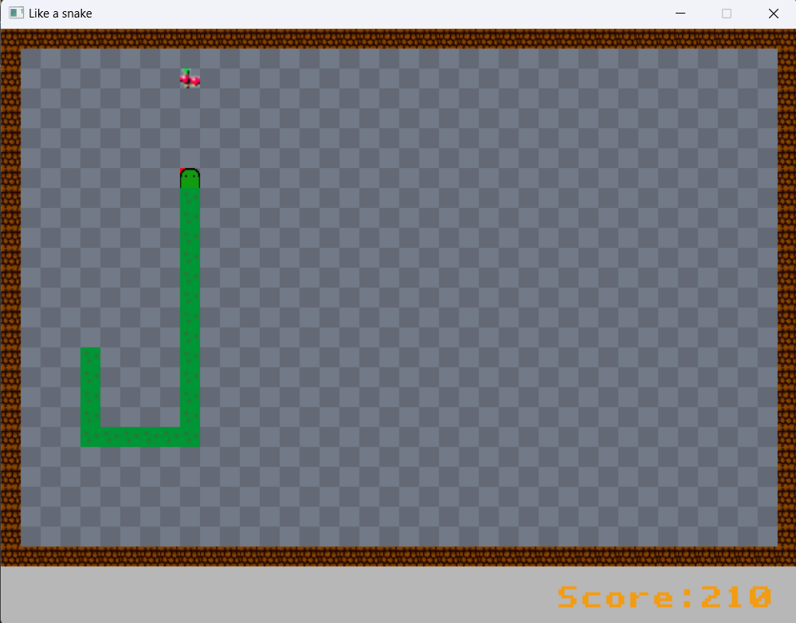
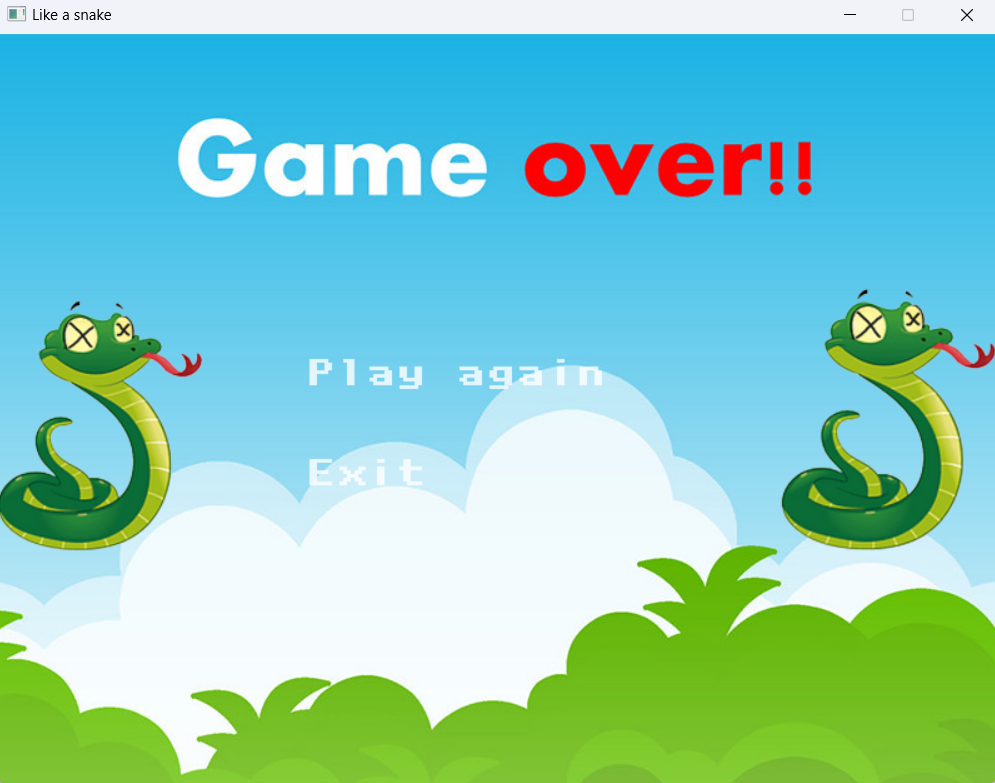

## **Introduction**

+ Họ và tên: Phạm Nam Khánh - K68CB - UET

+ Mã sinh viên: 23020088

+ Bài tập lớn: Like A Snake (LTNC_INT 2215 50_2324)

## **Description**

### *Game description and instruction*
- Đây là trò chơi rắn săn mồi hoàn toàn mới với rất nhiều tính năng hay, vượt trội. Chế độ chơi cho người chơi là:
  Game mode 1 - 1 Player: giống với rắn săn mồi truyền thống người chơi sử dụng các phím để di chuyển rắn đến quả mâm xôi.
  
- Có âm thanh êm dịu thoải mái khi chơi và tiếng ăn quả hoặc khi rắn chết.
  
- Like A Snake chắc chắn sẽ không khiến cho người chơi phải thất vọng với những tính năng, đồ họa cực kì độc đáo, mới lạ.

- Video demo: https://www.youtube.com/watch?v=dGSprr8MDMs

### *Control*

| Control |  Player  | 
|---------|----------|
| UP      |     w    |
| DOWN    |     s    |
| LEFT    |     a    |
| RIGHT   |     d    | 

### *Preview*

## **Setup**
- *Cách 1*:
1. Tải file like_a_snake. tại link sau: https://github.com/nkhanhhh/like_a_snake/releases/tag/v1.0
2. Giải nén vào ổ C: (lưu ý: để folder giải nén trong ổ C: vì project load ảnh bằng đường dẫn tuyệt đối).
3. Tìm file .exe trong folder like_a_snake để chạy trò chơi.

- *Cách 2*:
1. Clone source code về máy
2. Sử dụng IDE: Visual Studio 2022 để liên kết thư viện và chạy trò chơi.
3. Chi tiết về cách liên kết thư viện trên Visual Studio:https://lazyfoo.net/tutorials/SDL/01_hello_SDL/windows/msvc2019/index.php

*Mọi khó khăn trong phần cài đặt, trong quá trình chơi, hãy email qua 23020088@vnu.edu.vn.*

## **See also**

### *Các kỹ thuật sử dụng*
- Thư viện SDL2.
- Sử dụng nhiều class, tách file, nạp chồng toán tử, ...
- Tạo các đối tượng: rắn, quả, tường, ...
- Xử lý thao tác chuột và bàn phím, âm thanh, hình ảnh, chữ.
- Tạo menu và các nút ấn di chuyển giữa các menu.
- Sử dụng photoshop để tự edit hầu hết các ảnh trong game.

### *Nguồn tham khảo*
- Cách sử dụng thư viện SDL2, quản lý chương trình: tham khảo trên lazyfoo và các videos trên kênh Youtube: Phát Triển Phần Mềm 123A-Z, Let's Make Games, Mike Shah, codegopher ...
- Hình ảnh: tìm kiếm trên google và itch.io.
- Âm thanh: tìm kiếm trên google.

## **Conclusion**

### ***Điểm tâm đắc***
- Em thấy mình đã cải thiện được rất nhiều kỹ năng trong việc viết code, khả năng lên ý tưởng, các kỹ năng photoshop.
- Project này là do em tự làm, không đi sao chép ở đâu.
- Hầu hết hình ảnh không quá đẹp nhưng nó lại tạo được tính độc đáo, mới lạ cho chương trình.
- Học được cách setup môi trường, sử dụng thư viện ngoài.
- Chương trình rất dễ để refactor cũng như update tính năng.

### ***Điểm hạn chế***
- Rắn trong chương trình chưa xử lý được bo góc quay và thêm đuôi.
- Chưa đa dạng mode game.

### ***Hướng phát triển***
- Thêm nhiều loại đồ ăn có tính năng khác nhau.
- Cập nhật tính năng bảng xếp hạng, sau mỗi lần người chơi sẽ được nhập tên để lưu lại kết quả chơi của mình.
- Thêm chế độ điều chỉnh tốc độ của người chơi có thể chọn tốc độ tùy thích, phù hợp với khả năng chơi của mình.
- Phát triển các level games khi đạt được mức độ điểm nhất định thì sẽ chuyển sang map khác.

## A Special Thanks To
 - **TS.Lê Đức Trọng**
 - **CN. Trần Trường Thủy**

### *Mức điểm tự đánh giá: 8 - 8.5 / 10*
